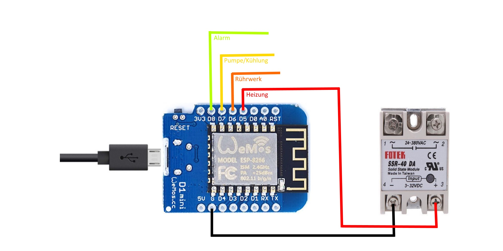

# ISSR
WIFI Relais für Brauerei

## Danksagung:
Danke möchte ich hier wieder glassart sagen, der mich immer kräftig beim Testen unterstützt.

## Bauteileliste:

- WEMOS D1 Mini
- 1-4 Stück SSR oder Relais/Relaiskarte
- ggf. USB-Kabel und USB-Steckernetzteil ( hat wohl jeder heute was rum zu liegen )

Sieht kompliziert aus, ist es aber gar nicht ....

ISSR gem. Schaltplan.jpg verdrahten

## Installation:

- ISSR am USB-Port anschließen
- ESP8266Flasher.exe öffnen
- Auf Config Reiter wechseln
- ISSR.bin öffnen ( Erstes Zahnrädchen )
- Auf Operation Reiter wechseln
- COM-Port des WEMOS auswählen
- Flashen

### Das ISSR ist fertig !

## Bedienung:

- Zwei mal Reset am WEMOS drücken, dazwischen ein zwei Sekunden Pause lassen.
- WEMOS spannt ein eigenes WLAN-Netzwerk auf, die LED am WEMOS leuchtet durchgehend.
- Mit geeignetem Gerät mit dem WLAN des WEMOS verbinden ( z.B. Handy, Tablet, Laptop.... )
- Browser an dem verbunden Gerät öffnen.
- Wenn die Config-Seite nicht automatisch öffnet im Browser die Adresse 192.168.4.1 eingeben
- Auf Config clicken und die WLAN-Daten und High-/ Lowactive für die SSR/Relais eingeben - anschliessend "SAVE" drücken
- Der WEMOS prüft jetzt, ob die Eingaben stimmen, verbindet sich mit dem angegebenen WLAN-Netzwerk.

## Verhalten:

Der WEMOS sucht jetzt nach UDP-Nachrichten der Brauerei auf dem eingegeben Port. Empfängte er eine Nachricht schaltet er die Relais dazu passend.

## Bedienung in der Brauerei:

- In der Brauerei "Arduino-Relais" anhaken.
- Auf dem Arduino Reiter "LAN/WLAN" wählen und den passenden "Port-Out" wählen. 
- Bei "IP-Out" entweder direkt die IP des WEMOS oder die IP des WEMOS aber als letzte Zahl .255 angeben
- "Port-In" und "Sensortyp" spielen für das iSSR keine Rolle. 

## Abschluss:

Fertig, die Relais sollten jetzt durch die Brauerei geschaltet werden.
Diese Prozedur ist nur einmal nötig. Die Einstellungen bleiben in der Brauerei und im WEMOS erhalten.
Will man die Einstellungen ändern, 2x mit kurzem Abstand Reset am WEMOS drücken.
Die USB-Verbindung ist ebenfalls nicht mehr nötig. Der WEMOS kann mit einem beliebigen Handy-USB-Ladegerät 
mit Spannung versorgt werden.
Die Datenübertragung erfolgt kabellos per WLAN.
